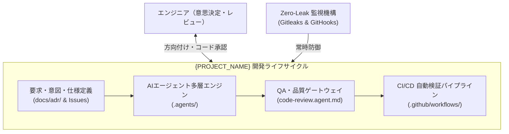

# {PROJECT_NAME}

**{PROJECT_DESCRIPTION_JA}**  
*エンタープライズ品質の堅牢性、マルチAIエージェント協調、および最新開発標準を統合したリポジトリ基盤*

[](LICENSE)
[]({REPOSITORY_URL}/actions)
[](SECURITY.md)
[](https://buymeacoffee.com/{BUY_ME_A_COFFEE_USERNAME})

[English Version (README.md)](README.md) | [🏛️ アーキテクチャ概要](docs/architecture/overview.md) | [📖 実践利用ガイド](docs/guides/getting-started.md) | [🔒 セキュリティポリシー](SECURITY.md) | [📋 ADR 記録集](docs/adr/)

---

## 🌟 概要 (Overview)

`{PROJECT_NAME}` は、2026年のソフトウェア開発エコシステムに最適化されたプロダクションレディなテンプレートリポジトリです。以下の4大支柱を標準提供します。

- **AIネイティブ協調開発 (`.agents/`)**: 自律型Coding Agent、専門審査レビューゲート、および主要9言語（C, C++, C#, TypeScript, JavaScript, Dart, Go, Rust, Python）に対応した多層構造の2026年標準 `SKILL.md` パッケージ。
- **多層防御セキュリティ**: OWASP / Gitleaks 準拠のシークレット漏洩完全排除と、間接プロンプトインジェクション（Clinejection等）への防御機構。
- **自動化ライフサイクル & CI/CD**: Conventional Commits 規約検証、ブランチ保護、およびセマンティックバージョニング自動リリース。
- **ワンタッチ展開エンジン**: `template.config.yaml` のKey-Value定義を `scripts/apply-template.py` でリポジトリ全体へ全自動適用。

---

## 🏛️ システムアーキテクチャ



---

## 🚀 クイックスタート

### 1. テンプレートからの初期化
本テンプレートから新しいリポジトリを作成した場合：

```bash
# リポジトリのクローン
git clone {REPOSITORY_URL}.git
cd {REPOSITORY_NAME}

# template.config.yaml (または .json) を編集してプロジェクト情報を設定
# 以下のスクリプトで全ファイルへプレースホルダーを一括自動置換
python scripts/apply-template.py

# コミット前自動検証フック (.githooks/) を有効化
python scripts/install-hooks.py
```

### 2. 主な運用コマンド

| コマンド | 説明 |
| :--- | :--- |
| `python scripts/apply-template.py --dry-run` | ファイルを変更せずに置換プレビューを確認 |
| `python scripts/apply-template.py --check` | 未置換プレースホルダーが残存していないか静的走査 |
| `python scripts/apply-template.py --finalize` | パラメータ適用完了後、初期化用設定ファイルを安全に削除 |
| `python scripts/install-hooks.py` | ローカルの `.githooks/` を有効化してシークレット漏洩を自動防止 |

---

## 🤖 マルチAI CLIツール対応

| AI ツール | 設定ファイル | 役割と連携機能 |
| :--- | :--- | :--- |
| **Claude Code** | [`CLAUDE.md`](CLAUDE.md) | スラッシュコマンド（`/status`, `/test`, `/review`, `/plan`）およびガバナンス規則参照 |
| **Google Antigravity** | [`.gemini/GEMINI.md`](.gemini/GEMINI.md) & `.agents/` | Two-Phase Governance、自律スキル実行、エージェント定義参照 |
| **GitHub Copilot** | [`.github/copilot-instructions.md`](.github/copilot-instructions.md) | アーキテクチャ標準およびコンテキスト階層（ガバナンス優先）の遵守 |
| **Cursor / Windsurf** | [`.cursorrules`](.cursorrules) | エディタ統合インライン補完・設計ルール遵守 |

---

## 🗂️ 多層AIエコシステム一覧

すべてのリソースは厳格な命名規則（Agent定義は `*.agent.md` かつ先頭 `agent-` 禁止、ルール・ワークフロー・スキルは種別プレフィックス付きケバブケース；詳細は [`.agents/rules/naming-rules-general.md`](.agents/rules/naming-rules-general.md) 参照）に従って体系化されています。

| 分類 | ファイル / パス | 概要 |
| :--- | :--- | :--- |
| **エージェント（基底層）** | [`.agents/agents/system-architect.agent.md`](.agents/agents/system-architect.agent.md) | システム設計・ADR整合性統制 |
| | [`.agents/agents/coding.agent.md`](.agents/agents/coding.agent.md) | 言語非依存の基本Coding Agent |
| | [`.agents/agents/code-review.agent.md`](.agents/agents/code-review.agent.md) | 言語非依存の基本Review Agent |
| | [`.agents/agents/qa-gatekeeper.agent.md`](.agents/agents/qa-gatekeeper.agent.md) | 受入基準審査・回帰テスト検証 |
| | [`.agents/agents/security-sentinel.agent.md`](.agents/agents/security-sentinel.agent.md) | シークレット・プロンプトインジェクション防御 |
| | [`.agents/agents/docs-maintainer.agent.md`](.agents/agents/docs-maintainer.agent.md) | ドキュメント・API同期エージェント |
| **エージェント（言語特化）** | [`.agents/agents/languages/`](.agents/agents/languages/) | 9言語対応 `coding-profile-<lang>.md` & `code-review-profile-<lang>.md` |
| **スキル（汎用）** | [`.agents/skills/git-workflow/`](.agents/skills/git-workflow/SKILL.md) | Conventional Commits & PR管理 |
| | [`.agents/skills/tdd-cycle/`](.agents/skills/tdd-cycle/SKILL.md) | Red-Green-Refactor サイクル自動化 |
| | [`.agents/skills/code-review-gatekeeper/`](.agents/skills/code-review-gatekeeper/SKILL.md) | 品質審査ルーブリック評価 |
| | [`.agents/skills/security-secret-audit/`](.agents/skills/security-secret-audit/SKILL.md) | シークレットスキャン・脆弱性検査 |
| | [`.agents/skills/adr-management/`](.agents/skills/adr-management/SKILL.md) | ADR（設計決定記録）の作成・更新 |
| **スキル（言語ツールチェーン）** | [`.agents/skills/toolchain-python/`](.agents/skills/) | 9言語それぞれのビルド・テスト・Lint実行ツール (`toolchain-<lang>`) |
| **スキル（言語コードレビュー）** | [`.agents/skills/code-review-python/`](.agents/skills/) | 9言語それぞれのコードレビュー監査ツール (`code-review-<lang>`) |
| **規約・ルール** | [`.agents/rules/coding-rules-general.md`](.agents/rules/coding-rules-general.md) | 言語非依存の設計原則（KISS, DRY, SOLID） |
| | [`.agents/rules/naming-rules-general.md`](.agents/rules/naming-rules-general.md) | ファイル・ディレクトリ命名規則 |
| | [`.agents/rules/languages/`](.agents/rules/languages/) | 9言語それぞれのコーディング規約 (`coding-rules-<lang>.md`) |
| **ワークフロー** | [`.agents/workflows/workflow-spec-to-code.md`](.agents/workflows/workflow-spec-to-code.md) | 仕様策定から実装・PR作成に至る標準作業手順 (SOP) |
| | [`.agents/workflows/workflow-incident-response.md`](.agents/workflows/workflow-incident-response.md) | セキュリティ・不具合トリアージ手順 (SOP) |

---

## 🤝 コントリビューション & 開発支援

プルリクエストや Issue の報告を歓迎します。詳細は [CONTRIBUTING.md](CONTRIBUTING.md) をご覧ください。

もしこのテンプレートや関連ツールが役に立ちましたら、開発継続へのご支援をお願いいたします。

[](https://buymeacoffee.com/{BUY_ME_A_COFFEE_USERNAME})

---

## 📄 ライセンス

{LICENSE_TYPE} License - Copyright (c) {CURRENT_YEAR} @{AUTHOR_GITHUB} ({AUTHOR_NAME})  
詳細は [LICENSE](LICENSE) をご覧ください。
