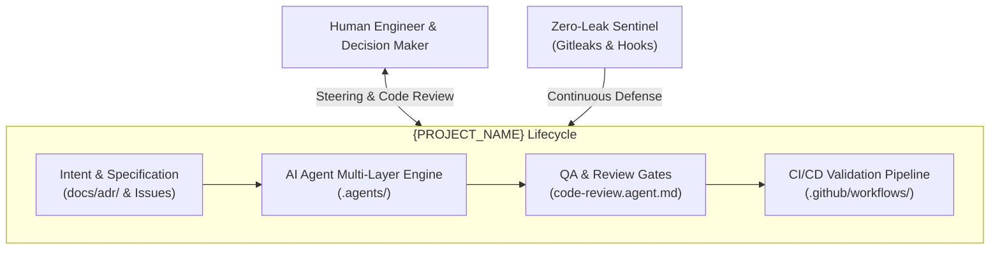

# {PROJECT_NAME}

**{PROJECT_DESCRIPTION}**  
*Built for production-grade robustness, multi-agent AI cooperation, and modern engineering standards.*

[](LICENSE)
[]({REPOSITORY_URL}/actions)
[](SECURITY.md)
[](https://buymeacoffee.com/{BUY_ME_A_COFFEE_USERNAME})

[日本語版 (README.ja.md)](README.ja.md) | [🏛️ Architecture Overview](docs/architecture/overview.md) | [📖 Getting Started](docs/guides/getting-started.md) | [🔒 Security Policy](SECURITY.md) | [📋 ADR Records](docs/adr/)

---

## 🌟 Overview

`{PROJECT_NAME}` is an enterprise-grade, production-ready repository standard engineered for the 2026 software development ecosystem. It integrates:

- **AI-Native Engineering (`.agents/`)**: Multi-layered support for autonomous coding agents, specialized review gates, and 2026 `SKILL.md` packages across 9 major programming languages (C, C++, C#, TypeScript, JavaScript, Dart, Go, Rust, Python).
- **Defense-in-Depth Security**: Strict OWASP/Gitleaks secret leakage prevention and indirect prompt injection defenses.
- **Automated Lifecycle & CI/CD**: Conventional Commits, branch protection verification, and automated semantic releases.
- **One-Touch Customization Engine**: Parameter-driven placeholder substitution via `scripts/apply-template.py`.

---

## 🏛️ System Architecture



---

## 🚀 Quick Start

### 1. Initialize from Template
If this repository was instantiated from a GitHub Template:

```bash
# Clone the repository
git clone {REPOSITORY_URL}.git
cd {REPOSITORY_NAME}

# Edit configuration parameters in template.config.yaml (or .json)
# Then apply substitution across all repository files:
python scripts/apply-template.py

# Install automated Git Hooks (.githooks/)
python scripts/install-hooks.py
```

### 2. Available Commands

| Command | Action |
| :--- | :--- |
| `python scripts/apply-template.py --dry-run` | Preview placeholder replacements without modifying files |
| `python scripts/apply-template.py --check` | Verify zero unresolved placeholders remain in codebase |
| `python scripts/apply-template.py --finalize` | Apply parameters and remove template setup files |
| `python scripts/install-hooks.py` | Configure local `.githooks/` for pre-commit secret checks |

---

## 🤖 Multi-AI Tool Integration

| AI Tool | Configuration File | Role & Integration |
| :--- | :--- | :--- |
| **Claude Code** | [`CLAUDE.md`](CLAUDE.md) | Slash commands (`/status`, `/test`, `/review`, `/plan`) and governance rules |
| **Google Antigravity** | [`.gemini/GEMINI.md`](.gemini/GEMINI.md) & `.agents/` | Two-phase governance, autonomous skill loading, agent roles |
| **GitHub Copilot** | [`.github/copilot-instructions.md`](.github/copilot-instructions.md) | Architectural standards and context hierarchy enforcement |
| **Cursor / Windsurf** | [`.cursorrules`](.cursorrules) | Editor-level inline intelligence and rules adherence |

---

## 🗂️ Multi-Layer AI Ecosystem Index

All resources follow strict naming conventions (agent definitions use `*.agent.md` with no `agent-` prefix; rules, workflows, and skills follow category-prefixed kebab-case; see [`.agents/rules/naming-rules-general.md`](.agents/rules/naming-rules-general.md)):

| Category | File / Path | Description |
| :--- | :--- | :--- |
| **Agents (Core)** | [`.agents/agents/system-architect.agent.md`](.agents/agents/system-architect.agent.md) | System design & ADR governance |
| | [`.agents/agents/coding.agent.md`](.agents/agents/coding.agent.md) | Language-agnostic base coding agent |
| | [`.agents/agents/code-review.agent.md`](.agents/agents/code-review.agent.md) | Language-agnostic base review agent |
| | [`.agents/agents/qa-gatekeeper.agent.md`](.agents/agents/qa-gatekeeper.agent.md) | Quality gate & regression verification |
| | [`.agents/agents/security-sentinel.agent.md`](.agents/agents/security-sentinel.agent.md) | Secret & Prompt injection defense |
| | [`.agents/agents/docs-maintainer.agent.md`](.agents/agents/docs-maintainer.agent.md) | Documentation & API sync agent |
| **Agents (Language Profiles)** | [`.agents/agents/languages/`](.agents/agents/languages/) | `coding-profile-<lang>.md` & `code-review-profile-<lang>.md` for 9 languages |
| **Skills (General)** | [`.agents/skills/git-workflow/`](.agents/skills/git-workflow/SKILL.md) | Conventional Commits & PR hygiene |
| | [`.agents/skills/tdd-cycle/`](.agents/skills/tdd-cycle/SKILL.md) | Red-Green-Refactor test cycle automation |
| | [`.agents/skills/code-review-gatekeeper/`](.agents/skills/code-review-gatekeeper/SKILL.md) | Automated review rubric checks |
| | [`.agents/skills/security-secret-audit/`](.agents/skills/security-secret-audit/SKILL.md) | Secret scanning & CVE audit |
| | [`.agents/skills/adr-management/`](.agents/skills/adr-management/SKILL.md) | Architecture Decision Record creation |
| **Skills (Toolchains)** | [`.agents/skills/toolchain-python/`](.agents/skills/) | `toolchain-<lang>` for 9 supported languages |
| **Skills (Language Reviews)** | [`.agents/skills/code-review-python/`](.agents/skills/) | `code-review-<lang>` for 9 supported languages |
| **Rules** | [`.agents/rules/coding-rules-general.md`](.agents/rules/coding-rules-general.md) | Clean code principles (DRY, KISS, SOLID) |
| | [`.agents/rules/naming-rules-general.md`](.agents/rules/naming-rules-general.md) | File & directory naming conventions |
| | [`.agents/rules/languages/`](.agents/rules/languages/) | Specific coding rules (`coding-rules-<lang>.md`) for 9 languages |
| **Workflows** | [`.agents/workflows/workflow-spec-to-code.md`](.agents/workflows/workflow-spec-to-code.md) | Spec-to-Code standard operating procedure |
| | [`.agents/workflows/workflow-incident-response.md`](.agents/workflows/workflow-incident-response.md) | Security & defect triage SOP |

---

## 🤝 Contribution & Support

Contributions are welcome! Please read [CONTRIBUTING.md](CONTRIBUTING.md) before submitting pull requests.

[](https://buymeacoffee.com/{BUY_ME_A_COFFEE_USERNAME})

---

## 📄 License

{LICENSE_TYPE} License - Copyright (c) {CURRENT_YEAR} @{AUTHOR_GITHUB} ({AUTHOR_NAME})  
See [LICENSE](LICENSE) for details.
